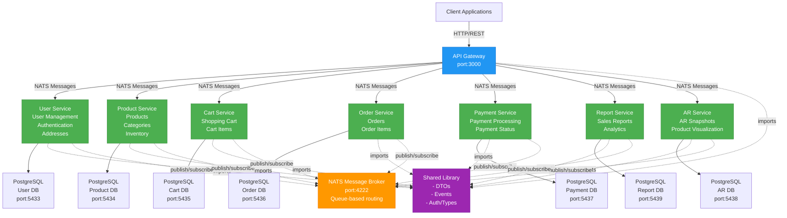

# System Design & Architecture - E-Commerce Microservices Platform

## Architecture Overview

This is a **microservices-based e-commerce platform** built with NestJS using a monorepo structure. The system follows a scalable architecture with:

- API Gateway pattern for client access
- Domain-driven services (Users, Products, Cart, Orders, Payments, Reports, AR)
- Asynchronous communication via NATS message queue
- Database-per-service pattern with PostgreSQL
- Shared library for DTOs, types, and events

### Architecture Diagram



## Technology Stack & Rationale

| Layer             | Technology      | Rationale                                                                 |
| ----------------- | --------------- | ------------------------------------------------------------------------- |
| **Framework**     | NestJS 11       | Enterprise-grade TypeScript framework with built-in microservices support |
| **Language**      | TypeScript 5.7  | Type-safety, better IDE support, reduced runtime errors                   |
| **Database**      | PostgreSQL 16   | Reliable RDBMS with ACID guarantees, proven for production                |
| **ORM**           | Prisma          | Type-safe, modern ORM with excellent TypeScript support and migrations    |
| **Message Queue** | NATS 2.10       | Lightweight, high-performance pub/sub for microservices                   |
| **Deployment**    | Docker          | Containerized services for consistent environments                        |
| **Testing**       | Jest            | Comprehensive testing framework with TypeScript support                   |
| **Validation**    | class-validator | Decorator-based data validation                                           |
| **Auth**          | JWT + bcryptjs  | Secure authentication with standard tokens                                |
| **API Pattern**   | REST            | Simple, well-understood API design                                        |

## Key Components & Responsibilities

### 1. API Gateway (`apps/gateway/`)

- **Responsibility**: Single entry point for all client requests
- **Port**: 3000
- **Communication**: NATS client to route requests to microservices
- **Features**:
  - Request routing
  - Response aggregation
  - Error handling
- **Technology**: NestJS HTTP server with ClientsModule

### 2. User Service (`apps/user-app/`)

- **Responsibility**: User management and authentication
- **Port**: 3001
- **Entities**:
  - `User`: Account information, authentication
  - `Address`: Delivery addresses for users
- **Database**: PostgreSQL (port 5433)
- **Key Events**: User CRUD, Login, Verify, Address management
- **Auth**: JWT-based with password hashing

### 3. Product Service (`apps/product-app/`)

- **Responsibility**: Product catalog management
- **Port**: 3002
- **Entities**:
  - `Category`: Product categories with hierarchy
  - `Product`: Product information with stock management
- **Database**: PostgreSQL (port 5434)
- **Features**:
  - Hierarchical categories (parent-child)
  - Stock management (increment/decrement)
  - Product search by slug
  - 3D model URLs for AR
- **Key Events**: Product CRUD, Stock management, Category operations

### 4. Cart Service (`apps/cart-app/`)

- **Responsibility**: Shopping cart management
- **Port**: 3003
- **Entities**:
  - `Cart`: Session-based or user-based cart
  - `CartItem`: Items in cart with pricing snapshot
- **Database**: PostgreSQL (port 5435)
- **Features**:
  - Session-based carts (pre-login)
  - User carts (post-login)
  - Cart transfer from session to user
  - Item quantity management
- **Key Events**: Cart operations, Add/Remove items, Clear, Transfer to user

### 5. Order Service (`apps/order-app/`)

- **Responsibility**: Order management
- **Port**: 3004
- **Entities**:
  - `Order`: Order header with status tracking
  - `OrderItem`: Line items in an order
- **Database**: PostgreSQL (port 5436)
- **Features**:
  - Order creation
  - Status tracking (PENDING, CONFIRMED, SHIPPED, etc.)
  - Order history per user
- **Key Events**: Create, Get, List by user, Update status, Cancel

### 6. Payment Service (`apps/payment-app/`)

- **Responsibility**: Payment processing
- **Port**: 3005
- **Entities**:
  - `Payment`: Payment records with method and status
- **Database**: PostgreSQL (port 5437)
- **Features**:
  - Multiple payment methods
  - Payment status tracking (PENDING, SUCCESS, FAILED)
  - Payload storage for extended info
- **Key Events**: Process, Verify, Get by order ID

### 7. Report Service (`apps/report-app/`)

- **Responsibility**: Analytics and reporting
- **Port**: 3006
- **Entities**:
  - `ReportEntry`: Time-series report data
- **Database**: PostgreSQL (port 5539)
- **Reports**:
  - Sales summary
  - Product performance
  - User cohort analysis
- **Key Events**: Generate reports, Query analytics

### 8. AR Service (`apps/ar-app/`)

- **Responsibility**: Augmented Reality features
- **Port**: 3007
- **Entities**:
  - `ARSnapshot`: AR visualization snapshots
- **Database**: PostgreSQL (port 5438)
- **Features**:
  - Store AR product snapshots
  - User AR history
  - Product visualization metadata
- **Key Events**: Create snapshot, List snapshots

### 9. Shared Library (`libs/shared/`)

- **Responsibility**: Cross-service shared code
- **Contents**:
  - DTOs for all services
  - Event definitions (NATS topics)
  - Authentication types
  - User roles and types
  - Prisma client service wrapper
- **No Database**: Library only, imported by all services

## Data Models & Relationships

### User Service Schema

```
User
├── id (CUID)
├── email (unique)
├── passwordHash
├── fullName
├── phone
├── role (default: "CUSTOMER")
├── isActive
└── addresses → Address[]

Address
├── id (CUID)
├── userId → User
├── fullName
├── phone
├── street, ward, district, city
├── isDefault
└── createdAt
```

### Product Service Schema

```
Category
├── id (CUID)
├── name
├── slug (unique)
├── description
├── parentId → Category (optional)
└── children → Category[]

Product
├── id (CUID)
├── sku (unique)
├── name
├── slug (unique)
├── priceInt (stored in cents)
├── stock
├── description
├── imageUrls []
├── categoryId → Category (optional)
├── attributes (JSON)
├── model3dUrl
└── createdAt
```

### Cart & Order Service Schema

```
Cart
├── id (CUID)
├── sessionId (unique)
├── userId (optional)
└── items → CartItem[]

CartItem
├── id (CUID)
├── cartId → Cart
├── productId (reference)
├── quantity
├── priceInt (snapshot at time of add)
└── createdAt

Order
├── id (CUID)
├── userId
├── addressId (optional)
├── status (PENDING, CONFIRMED, etc.)
├── totalInt
└── items → OrderItem[]

OrderItem
├── id (CUID)
├── orderId → Order
├── productId (reference)
├── quantity
├── priceInt (snapshot at time of order)
└── createdAt
```

### Payment & Reports Schema

```
Payment
├── id (CUID)
├── orderId
├── method (CREDIT_CARD, BANK_TRANSFER, etc.)
├── amountInt
├── status (PENDING, SUCCESS, FAILED)
├── payload (JSON for extended info)
└── createdAt

ReportEntry
├── id (CUID)
├── type (SALES, PRODUCT_PERF, USER_COHORT)
├── payload (JSON report data)
├── fromAt (optional)
├── toAt (optional)
└── createdAt
```

### AR Service Schema

```
ARSnapshot
├── id (CUID)
├── userId (optional)
├── productId
├── imageUrl
├── metadata (JSON)
└── createdAt
```

## API Communication Patterns

### 1. Gateway → Services Communication (NATS)

**Pattern**: Request-Response via message patterns

```typescript
// Gateway calls User Service
this.userService.send('user.findById', { id: 'user-123' })

// User Service listens
@MessagePattern(EVENTS.USER.FIND_BY_ID)
async findById(data: { id: string })
```

**Implemented via**: NestJS `@MessagePattern()` decorator

### 2. Event Types (from `libs/shared/events.ts`)

**User Events**:

- `user.findById`, `user.findByEmail`, `user.create`, `user.update`, `user.deactivate`, `user.list`

**Auth Events**:

- `auth.login`, `auth.verify`, `auth.refresh`

**Address Events**:

- `address.listByUser`, `address.create`, `address.update`, `address.delete`

**Product Events**:

- `product.getById`, `product.getBySlug`, `product.list`, `product.create`, `product.update`, `product.delete`, `product.incrementStock`, `product.decrementStock`

**Category Events**:

- `category.getById`, `category.getBySlug`, `category.list`, `category.create`, `category.update`, `category.delete`

**Cart Events**:

- `cart.get`, `cart.addItem`, `cart.removeItem`, `cart.clear`, `cart.transferToUser`

**Order Events**:

- `order.create`, `order.get`, `order.listByUser`, `order.updateStatus`, `order.cancel`

**OrderItem Events**:

- `orderItem.listByOrder`, `orderItem.addItem`, `orderItem.removeItem`

**Payment Events**:

- `payment.process`, `payment.verify`, `payment.getById`, `payment.getByOrder`

**Report Events**:

- `report.salesSummary`, `report.productPerformance`, `report.userCohort`

**AR Events**:

- `ar.snapshotCreate`, `ar.snapshotList`

### 3. Authentication Guard

Each service implements `auth.guard.ts` for:

- JWT verification
- User extraction from token
- Role-based access control

## Design Decisions & Trade-offs

### 1. Database-per-Service Pattern ✓

**Decision**: Each microservice has its own PostgreSQL database

**Rationale**:

- Service independence: no shared database locks
- Scalability: each service can scale independently
- Technology flexibility: services can use different DB types if needed

**Trade-off**:

- **Challenge**: Cross-service data consistency
- **Solution**: NATS events for eventual consistency
- **Accepted Risk**: Temporary inconsistency in distributed system

### 2. NATS Message Queue ✓

**Decision**: Use NATS for inter-service communication instead of REST

**Rationale**:

- Async by default: decouples services
- Queue-based routing: built-in load balancing
- Low latency: lightweight protocol
- Pub/Sub + Request/Reply patterns

**Trade-off**:

- Complexity: NATS operational overhead vs REST simplicity
- Debugging: harder to trace async calls

### 3. Monorepo Structure ✓

**Decision**: Multiple NestJS apps in single repository

**Rationale**:

- Code sharing: shared library for DTOs, types
- Unified CI/CD pipeline
- Easier refactoring across services
- Single dependency management

**Trade-off**:

- Complexity: need good build tooling
- Repository size: all code in one place

### 4. Prisma ORM ✓

**Decision**: Use Prisma for database access and migrations

**Rationale**:

- Type-safe queries
- Built-in migration system
- Excellent TypeScript support
- Schema-driven development

**Trade-off**:

- Vendor lock-in: Prisma-specific syntax
- Less flexible than raw SQL for complex queries

### 5. JWT Authentication ✓

**Decision**: JWT tokens instead of session-based auth

**Rationale**:

- Stateless: no session storage needed
- Microservices-friendly: each service can validate independently
- Mobile-friendly: standard for APIs

**Trade-off**:

- Token revocation complexity
- Token size overhead in every request

### 6. Price Storage in Cents ✓

**Decision**: Store all prices as integers (cents) not decimals

**Rationale**:

- No floating-point precision issues
- Consistent across all services
- Easy to calculate and compare
- Standard e-commerce practice

## Non-Functional Requirements

### Performance

- **Response Time**: Gateway latency < 200ms for simple queries
- **Throughput**: Support 1000+ concurrent users
- **Database Query Time**: < 50ms for indexed queries

### Scalability

- **Horizontal Scaling**: All services stateless for easy scaling
- **Database**: Connection pooling via Prisma
- **Message Queue**: NATS supports clustering

### Reliability

- **Availability**: 99.9% target (3-9s downtime/month)
- **Data Durability**: PostgreSQL WAL (Write-Ahead Logging)
- **Backup**: Database backups outside scope (infra responsibility)

### Security

- **Authentication**: JWT tokens with expiration
- **Authorization**: Role-based access control (RBAC)
- **Password**: bcryptjs with salt for hashing
- **Data**: No sensitive data in logs
- **API**: REST only (no GraphQL complexity)

### Maintainability

- **Code Style**: ESLint enforced
- **Testing**: Unit and E2E test coverage > 80%
- **Documentation**: README in each service
- **Logging**: Structured logging for debugging

## Service Ports Summary

| Service     | Port | Container        |
| ----------- | ---- | ---------------- |
| Gateway     | 3000 | apps/gateway     |
| User App    | 3001 | apps/user-app    |
| Product App | 3002 | apps/product-app |
| Cart App    | 3003 | apps/cart-app    |
| Order App   | 3004 | apps/order-app   |
| Payment App | 3005 | apps/payment-app |
| Report App  | 3006 | apps/report-app  |
| AR App      | 3007 | apps/ar-app      |
| NATS        | 4222 | nats-server      |
| User DB     | 5433 | user_db          |
| Product DB  | 5434 | product_db       |
| Cart DB     | 5435 | cart_db          |
| Order DB    | 5436 | order_db         |
| Payment DB  | 5437 | payment_db       |
| AR DB       | 5438 | ar_db            |
| Report DB   | 5439 | report_db        |

## Key Files & Structure

```
backend-luan-van/
├── apps/                          # Microservices
│   ├── gateway/                   # API Gateway
│   ├── user-app/                  # User management
│   ├── product-app/               # Product catalog
│   ├── cart-app/                  # Shopping cart
│   ├── order-app/                 # Order management
│   ├── payment-app/               # Payment processing
│   ├── report-app/                # Reporting/Analytics
│   └── ar-app/                    # AR features
├── libs/shared/                   # Shared code
│   ├── dto/                       # All DTOs
│   ├── events.ts                  # NATS event definitions
│   ├── auth.ts                    # Auth utilities
│   └── types/                     # TypeScript types
├── docker-compose.yml             # Local development setup
├── nest-cli.json                  # NestJS monorepo config
└── package.json                   # Root dependencies
```
