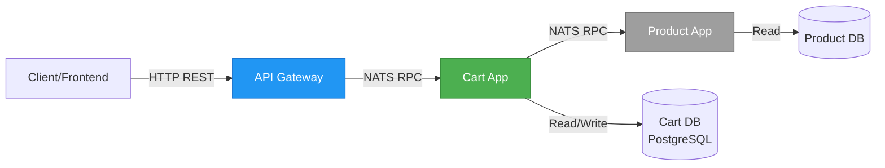
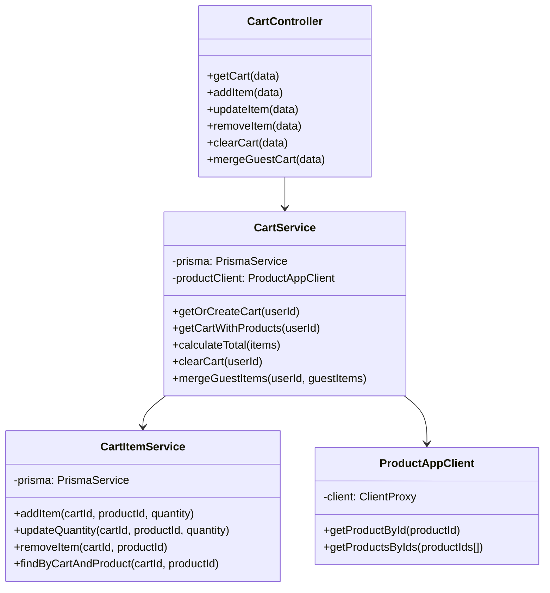

# System Design & Architecture - Cart Management

## Architecture Overview

Cart Management là một microservice trong hệ thống e-commerce, chịu trách nhiệm quản lý giỏ hàng cho khách hàng. Service này tương tác với Product Service để lấy thông tin giá sản phẩm realtime.

### Context Diagram



### Component Responsibilities

| Component       | Responsibility                                                | Communication       |
| --------------- | ------------------------------------------------------------- | ------------------- |
| **Frontend**    | Quản lý guest cart trong localStorage, gọi API khi user login | HTTP REST → Gateway |
| **Gateway**     | Route requests đến Cart App                                   | NATS → Cart App     |
| **Cart App**    | Business logic cho cart operations                            | NATS → Product App  |
| **Product App** | Cung cấp thông tin sản phẩm, giá                              | NATS response       |
| **Cart DB**     | Lưu trữ Cart và CartItem                                      | Prisma ORM          |

## Data Models & Schema

### Current Schema (Existing)

File: `apps/cart-app/prisma/schema.prisma`

```prisma
model Cart {
  id        String   @id @default(cuid())
  userId    String?  @unique
  sessionId String?  @unique
  items     CartItem[]
  createdAt DateTime @default(now())
  updatedAt DateTime @updatedAt
}

model CartItem {
  id        String   @id @default(cuid())
  cartId    String
  cart      Cart     @relation(fields: [cartId], references: [id], onDelete: Cascade)
  productId String
  quantity  Int
  createdAt DateTime @default(now())
  updatedAt DateTime @updatedAt

  @@unique([cartId, productId])
}
```

### Schema Analysis

**✅ No schema changes needed!** Schema hiện tại đã đủ để implement logic.

**Key Fields:**

- `Cart.userId`: Liên kết với user đã login (nullable cho guest cart - nhưng backend không lưu guest)
- `Cart.sessionId`: Không sử dụng trong scope này (backend không lưu guest cart)
- `CartItem.productId`: Reference đến Product (không có foreign key vì cross-service)
- `CartItem.quantity`: Số lượng sản phẩm
- `@@unique([cartId, productId])`: Đảm bảo 1 sản phẩm chỉ có 1 CartItem trong 1 cart

**Design Decision:** Không lưu `priceInt` snapshot trong CartItem vì:

- ✅ Giá luôn lấy realtime từ product-app khi view cart
- ✅ Tránh data inconsistency khi giá thay đổi
- ❌ Trade-off: Phải gọi product-app mỗi lần view cart (acceptable cho scope luận văn)

## API Design

### NATS Events (RPC)

All events follow pattern: `cart.*`

#### 1. Get Cart - `cart.get`

**Request:**

```typescript
{
  userId: string;
}
```

**Response:**

```typescript
{
  cart: {
    id: string;
    userId: string;
    items: Array<{
      id: string;
      productId: string;
      quantity: number;
      product?: {
        // Enriched from product-app
        name: string;
        priceInt: number;
        imageUrls: string[];
        slug: string;
      } | null; // null if product not found
    }>;
    totalInt: number; // Calculated sum
  }
}
```

**Errors:**

- `404 EntityNotFoundRpcException`: Cart không tồn tại (auto-create nếu cần)

---

#### 2. Add Item - `cart.addItem`

**Request:**

```typescript
{
  userId: string;
  productId: string;
  quantity: number; // Must be > 0
}
```

**Response:**

```typescript
{
  cartItem: {
    id: string;
    productId: string;
    quantity: number;
  }
}
```

**Errors:**

- `400 ValidationRpcException`: quantity <= 0 hoặc productId invalid
- `404 EntityNotFoundRpcException`: Product không tồn tại trong product-app

**Business Logic:**

- Nếu cart chưa tồn tại → tạo mới
- Nếu sản phẩm đã có trong cart → cộng dồn quantity
- Nếu sản phẩm chưa có → tạo CartItem mới

---

#### 3. Update Item Quantity - `cart.updateItem`

**Request:**

```typescript
{
  userId: string;
  productId: string;
  quantity: number; // Must be > 0, or 0 to remove
}
```

**Response:**

```typescript
{
  cartItem: {
    id: string;
    productId: string;
    quantity: number;
  } | null;  // null if removed (quantity = 0)
}
```

**Errors:**

- `400 ValidationRpcException`: quantity < 0
- `404 EntityNotFoundRpcException`: CartItem không tồn tại

**Business Logic:**

- Nếu quantity = 0 → xóa CartItem
- Nếu quantity > 0 → update quantity

---

#### 4. Remove Item - `cart.removeItem`

**Request:**

```typescript
{
  userId: string;
  productId: string;
}
```

**Response:**

```typescript
{
  success: boolean;
}
```

**Errors:**

- Idempotent: Không throw error nếu item không tồn tại

---

#### 5. Clear Cart - `cart.clear`

**Request:**

```typescript
{
  userId: string;
}
```

**Response:**

```typescript
{
  success: boolean;
}
```

**Errors:**

- Idempotent: Không throw error nếu cart rỗng

**Business Logic:**

- Xóa tất cả CartItem
- Giữ lại Cart entity (có thể reuse)

---

#### 6. Merge Guest Cart - `cart.merge`

**Request:**

```typescript
{
  userId: string;
  guestItems: Array<{
    productId: string;
    quantity: number;
  }>;
}
```

**Response:**

```typescript
{
  cart: {
    id: string;
    itemsCount: number;
  }
}
```

**Errors:**

- `400 ValidationRpcException`: guestItems invalid format

**Business Logic:**

- Lấy cart hiện tại của userId (hoặc tạo mới)
- Với mỗi guestItem:
  - Nếu productId đã có → cộng dồn quantity
  - Nếu chưa có → thêm mới CartItem
- Validate quantity > 0

## Component Design

### Service Layer Architecture

```
CartController (handles NATS messages)
    ↓
CartService (business logic)
    ↓
├─→ CartItemService (CartItem operations)
└─→ ProductAppClient (RPC to product-app)
```

### Class Diagram



## Key Design Decisions

### 1. No Price Snapshot in CartItem ✓

**Decision:** Không lưu giá sản phẩm trong CartItem

**Rationale:**

- ✅ Giá luôn realtime, user thấy giá mới nhất
- ✅ Không có data inconsistency
- ✅ Đơn giản hơn (không cần sync price)

**Trade-off:**

- ❌ Phải gọi product-app mỗi lần view cart (chậm hơn)
- ✅ Mitigate: Cache product data trong product-app, RPC call < 50ms

---

### 2. Guest Cart in Frontend Only ✓

**Decision:** Backend không lưu guest cart, frontend tự quản lý localStorage

**Rationale:**

- ✅ Đơn giản hơn, không cần sessionId logic
- ✅ Không tốn database cho guest users
- ✅ Frontend control guest data

**Trade-off:**

- ❌ Guest cart mất khi clear localStorage
- ✅ Acceptable: Guest không expect persistence

---

### 3. Auto-Create Cart on First Add ✓

**Decision:** Khi user add item lần đầu, tự động tạo Cart

**Rationale:**

- ✅ UX tốt hơn: không cần endpoint `cart.create` riêng
- ✅ Idempotent: `addItem` luôn succeed nếu product tồn tại

**Implementation:**

```typescript
async addItem(userId, productId, quantity) {
  let cart = await this.findByUserId(userId);
  if (!cart) {
    cart = await this.create({ userId });
  }
  // ... add item logic
}
```

---

### 4. Product Validation via RPC ✓

**Decision:** Validate productId bằng cách gọi product-app

**Rationale:**

- ✅ Đảm bảo product tồn tại trước khi add to cart
- ✅ Tránh orphan CartItem (productId không hợp lệ)

**Trade-off:**

- ❌ Thêm 1 RPC call → chậm hơn
- ✅ Mitigate: Product-app cache, RPC < 50ms

**Implementation:**

```typescript
async addItem(userId, productId, quantity) {
  // Validate product exists
  const product = await this.productClient.getProductById(productId);
  if (!product) {
    throw new EntityNotFoundRpcException('Product', productId);
  }

  // ... proceed with add logic
}
```

---

### 5. Batch Product Fetch for Cart View ✓

**Decision:** Khi get cart, gọi product-app 1 lần với nhiều productIds

**Rationale:**

- ✅ Performance: 1 RPC call thay vì N calls
- ✅ Giảm network overhead

**Implementation:**

```typescript
async getCartWithProducts(userId) {
  const cart = await this.getCart(userId);
  const productIds = cart.items.map(item => item.productId);

  // Batch fetch
  const products = await this.productClient.getProductsByIds(productIds);

  // Merge data
  const enrichedItems = cart.items.map(item => ({
    ...item,
    product: products.find(p => p.id === item.productId) || null
  }));

  return { ...cart, items: enrichedItems };
}
```

---

### 6. Quantity Validation Rules ✓

**Decision:** Validate quantity constraints

**Rules:**

- `quantity > 0`: Required khi add/update
- `quantity = 0`: Xóa item
- `quantity < 0`: Throw ValidationRpcException

**Rationale:**

- ✅ Tránh data inconsistency
- ✅ Clear error messages

---

## Integration Points

### Product App Integration

**Endpoint Used:** `product.getById`, `product.getByIds`

**Timeout Handling:**

```typescript
async getProductById(productId: string) {
  try {
    return await firstValueFrom(
      this.client.send('product.getById', { id: productId }).pipe(
        timeout(5000)  // 5s timeout
      )
    );
  } catch (error) {
    if (error.name === 'TimeoutError') {
      throw new ServiceUnavailableRpcException('Product service không phản hồi');
    }
    throw error;
  }
}
```

### Gateway Integration

**Routes:** (Already defined in `apps/gateway/src/cart/`)

- `GET /cart` → `cart.get`
- `POST /cart/items` → `cart.addItem`
- `PATCH /cart/items/:productId` → `cart.updateItem`
- `DELETE /cart/items/:productId` → `cart.removeItem`
- `DELETE /cart` → `cart.clear`
- `POST /cart/merge` → `cart.merge`

## Error Handling Strategy

### RPC Exceptions

Follow `docs/knowledge/RPC-EXCEPTIONS-GUIDE.md`:

| Scenario              | Exception                        | Status | Message                           |
| --------------------- | -------------------------------- | ------ | --------------------------------- |
| Product không tồn tại | `EntityNotFoundRpcException`     | 404    | `Sản phẩm không tồn tại`          |
| Cart không tồn tại    | Auto-create                      | -      | -                                 |
| Quantity <= 0 (add)   | `ValidationRpcException`         | 400    | `Số lượng phải lớn hơn 0`         |
| Quantity < 0 (update) | `ValidationRpcException`         | 400    | `Số lượng không hợp lệ`           |
| Product-app timeout   | `ServiceUnavailableRpcException` | 503    | `Service tạm thời không khả dụng` |
| Unexpected error      | `InternalServerRpcException`     | 500    | `Lỗi xử lý giỏ hàng`              |

### Error Propagation

```typescript
// CartController
@MessagePattern(EVENTS.CART.ADD_ITEM)
async addItem(data: AddItemDto) {
  try {
    return await this.cartService.addItem(data);
  } catch (error) {
    // Log for debugging
    console.error('[CartController] addItem error:', error);

    // Re-throw RPC exceptions
    if (error instanceof RpcException) {
      throw error;
    }

    // Wrap unknown errors
    throw new InternalServerRpcException('Lỗi thêm sản phẩm vào giỏ hàng');
  }
}
```

## Performance Considerations

### Database Queries

**Optimize with Prisma includes:**

```typescript
// Good: 1 query
const cart = await prisma.cart.findUnique({
  where: { userId },
  include: { items: true },
});

// Bad: N+1 queries
const cart = await prisma.cart.findUnique({ where: { userId } });
const items = await prisma.cartItem.findMany({ where: { cartId: cart.id } });
```

### RPC Call Optimization

**Batch product fetch:**

- ✅ 1 RPC call cho N products
- ❌ Tránh N RPC calls

**Timeout:**

- Default: 5s
- Fallback: Trả về `product: null` nếu timeout

### Caching Strategy (Future)

**Out of scope cho MVP, nhưng có thể thêm:**

- Redis cache cho product data (TTL 5 phút)
- In-memory cache cho cart data (TTL 1 phút)

## Security Considerations

### Authorization

**Rule:** User chỉ truy cập cart của chính họ

**Implementation:**

```typescript
async getCart(userId: string) {
  // No additional auth needed: userId comes from JWT
  // Gateway already validated JWT
  return this.prisma.cart.findUnique({ where: { userId } });
}
```

**Gateway handles:**

- JWT verification
- Extract userId from token
- Pass userId to cart-app

### Input Validation

**DTO với class-validator:**

```typescript
export class AddItemDto {
  @IsString()
  userId: string;

  @IsString()
  productId: string;

  @IsInt()
  @Min(1)
  quantity: number;
}
```

## Testing Strategy

### Unit Tests

- CartService: Tất cả methods (getCart, addItem, updateItem, removeItem, clear, merge)
- CartItemService: CRUD operations
- Mocks: PrismaService, ProductAppClient

### Integration Tests (E2E)

- Full flow: Add → Update → Get → Remove → Clear
- Error cases: Product not found, invalid quantity
- Edge cases: Merge empty guest cart, add same product twice

### Coverage Goal

- **Target:** 100% cho code mới
- **Tools:** Jest với coverage reporter
