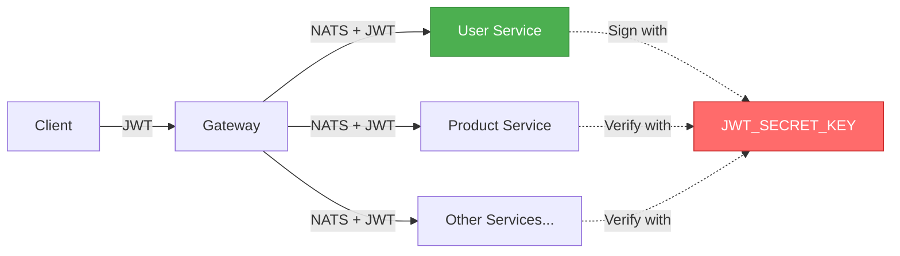
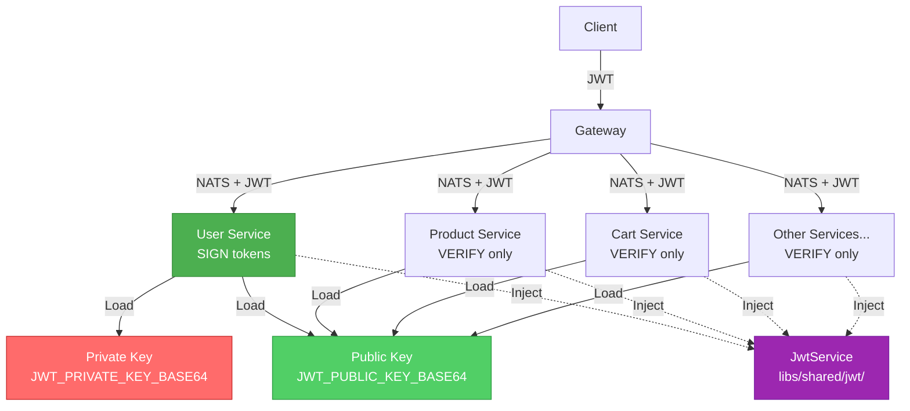

# System Design & Architecture - JWT Migration to Jose with RSA

## Architecture Overview

### Current Architecture (Before Migration)



**Problems**:

- ❌ Tất cả services đều có SECRET_KEY → có thể sign tokens
- ❌ Security risk: một service bị compromise = toàn hệ thống bị compromise
- ❌ `jsonwebtoken` library không hiện đại

---

### New Architecture (After Migration)



**Improvements**:

- ✅ Chỉ user-app có private key để sign
- ✅ Services khác chỉ verify với public key
- ✅ Centralized JwtService cho reusability
- ✅ Modern `jose` library

---

## Component Design

### 1. JwtService Module (`libs/shared/jwt/`)

**Responsibility**: Centralized JWT signing và verification với RSA

#### File Structure

```
libs/shared/jwt/
├── jwt.service.ts       # Core signing/verification logic
├── jwt.module.ts        # NestJS module configuration
└── interfaces.ts        # TypeScript interfaces
```

#### jwt.service.ts - Core Logic

```typescript
import { Injectable, UnauthorizedException } from '@nestjs/common';
import * as jose from 'jose';

export interface JwtPayload {
  userId: string;
  email: string;
  role: string;
  iat?: number;
  exp?: number;
}

@Injectable()
export class JwtService {
  private privateKey: jose.KeyLike | null = null;
  private publicKey: jose.KeyLike;

  private readonly algorithm = 'RS256';
  private readonly issuer = 'luan-van-ecommerce';

  async onModuleInit() {
    await this.loadKeys();
  }

  private async loadKeys() {
    // Load public key (required for all services)
    const publicKeyPEM = Buffer.from(process.env.JWT_PUBLIC_KEY_BASE64!, 'base64').toString(
      'utf-8',
    );

    this.publicKey = await jose.importSPKI(publicKeyPEM, this.algorithm);

    // Load private key (only for user-app)
    if (process.env.JWT_PRIVATE_KEY_BASE64) {
      const privateKeyPEM = Buffer.from(process.env.JWT_PRIVATE_KEY_BASE64, 'base64').toString(
        'utf-8',
      );

      this.privateKey = await jose.importPKCS8(privateKeyPEM, this.algorithm);
    }
  }

  // SIGN: Only user-app can call this
  async signToken(payload: Omit<JwtPayload, 'iat' | 'exp'>, expiresIn: number): Promise<string> {
    if (!this.privateKey) {
      throw new Error('Private key not loaded - cannot sign tokens');
    }

    return await new jose.SignJWT({ ...payload })
      .setProtectedHeader({ alg: this.algorithm })
      .setIssuedAt()
      .setIssuer(this.issuer)
      .setExpirationTime(`${expiresIn}s`)
      .setSubject(payload.userId)
      .sign(this.privateKey);
  }

  // VERIFY: All services can call this
  async verifyToken(token: string): Promise<JwtPayload> {
    try {
      const { payload } = await jose.jwtVerify(token, this.publicKey, {
        issuer: this.issuer,
      });

      return payload as JwtPayload;
    } catch (error) {
      if (error instanceof jose.errors.JWTExpired) {
        throw new UnauthorizedException('Token has expired');
      }
      if (error instanceof jose.errors.JWTClaimValidationFailed) {
        throw new UnauthorizedException('Token validation failed');
      }
      throw new UnauthorizedException('Invalid token');
    }
  }

  // DECODE: For debugging (no verification)
  decodeToken(token: string) {
    try {
      return {
        payload: jose.decodeJwt(token),
        header: jose.decodeProtectedHeader(token),
      };
    } catch {
      throw new UnauthorizedException('Invalid token format');
    }
  }
}
```

#### jwt.module.ts - Module Export

```typescript
import { Module, Global } from '@nestjs/common';
import { JwtService } from './jwt.service';

@Global() // Make available everywhere without importing
@Module({
  providers: [JwtService],
  exports: [JwtService],
})
export class JwtModule {}
```

---

### 2. Updated `libs/shared/auth.ts` (Wrapper Functions)

**Giữ nguyên exported functions để backwards compatibility, nhưng delegate logic cho JwtService**

```typescript
import { JwtService, JwtPayload } from './jwt/jwt.service';

// Singleton instance for use in shared functions
let jwtServiceInstance: JwtService | null = null;

export function initJwtService(jwtService: JwtService) {
  jwtServiceInstance = jwtService;
}

export type { JwtPayload };

/**
 * Extract and verify JWT token from Authorization header
 */
export async function verifyJwtFromHeader(
  headers: Record<string, string>,
): Promise<JwtPayload | null> {
  try {
    if (!jwtServiceInstance) {
      throw new Error('JwtService not initialized');
    }

    const authHeader = headers.authorization || headers.Authorization;
    if (!authHeader || typeof authHeader !== 'string') {
      return null;
    }

    const [scheme, token] = authHeader.split(' ');
    if (scheme !== 'Bearer' || !token) {
      return null;
    }

    return await jwtServiceInstance.verifyToken(token);
  } catch (error) {
    console.warn('[Auth] Token verification failed:', error);
    return null;
  }
}

/**
 * Generate JWT token (only user-app should call this)
 */
export async function generateJwt(
  payload: Omit<JwtPayload, 'iat' | 'exp'>,
  expiresIn: string = '15m',
): Promise<string> {
  if (!jwtServiceInstance) {
    throw new Error('JwtService not initialized');
  }

  const seconds = parseExpiresIn(expiresIn);
  return await jwtServiceInstance.signToken(payload, seconds);
}

function parseExpiresIn(expiresIn: string): number {
  const match = /^(\d+)([smhd])$/.exec(expiresIn);
  if (!match) return 900; // default 15 minutes

  const value = parseInt(match[1], 10);
  const unit = match[2];

  const multipliers: Record<string, number> = {
    s: 1,
    m: 60,
    h: 3600,
    d: 86400,
  };

  return value * (multipliers[unit] || 60);
}
```

---

### 3. Updated BaseAuthGuard (`libs/shared/guards/base-auth.guard.ts`)

**Minimal changes - inject JwtService và dùng nó thay vì verifyJwtFromHeader**

```typescript
import { CanActivate, ExecutionContext, Injectable, UnauthorizedException } from '@nestjs/common';
import { JwtService, JwtPayload } from '../jwt/jwt.service';

@Injectable()
export abstract class BaseAuthGuard implements CanActivate {
  constructor(protected readonly jwtService: JwtService) {}

  async canActivate(context: ExecutionContext): Promise<boolean> {
    try {
      const message = context.switchToRpc().getData();

      if (typeof message !== 'object' || message === null || !('headers' in message)) {
        throw new UnauthorizedException('Authentication required');
      }

      const headers = message.headers as Record<string, string>;
      const token = this.extractTokenFromHeader(headers);

      if (!token) {
        throw new UnauthorizedException('No token provided');
      }

      const decodedToken = await this.jwtService.verifyToken(token);

      this.validateTokenStructure(decodedToken);

      const isValid = await this.validateUser(decodedToken, message);
      if (!isValid) {
        throw new UnauthorizedException('User validation failed');
      }

      // Attach user to message
      (message as any).user = decodedToken;

      return true;
    } catch (error) {
      if (error instanceof UnauthorizedException) {
        throw error;
      }
      throw new UnauthorizedException('Authentication failed');
    }
  }

  protected extractTokenFromHeader(headers: Record<string, string>): string | null {
    const authHeader = headers.authorization || headers.Authorization;
    if (!authHeader) return null;

    const [type, token] = authHeader.split(' ');
    return type === 'Bearer' ? token : null;
  }

  protected validateTokenStructure(token: JwtPayload): void {
    if (!token.userId || !token.email || !token.role) {
      throw new UnauthorizedException('Invalid token payload');
    }
  }

  protected async validateUser(token: JwtPayload, message: unknown): Promise<boolean> {
    return true; // Subclasses override for custom validation
  }
}
```

---

### 4. Updated User-App Auth Service

**Inject JwtService và dùng nó để sign tokens**

```typescript
// apps/user-app/src/auth/auth.service.ts
import { Injectable } from '@nestjs/common';
import { JwtService } from '@shared/jwt/jwt.service';

@Injectable()
export class AuthService {
  constructor(private readonly jwtService: JwtService) {}

  async login(dto: LoginDto) {
    // ... existing login logic ...

    const payload = {
      userId: user.id,
      email: user.email,
      role: user.role,
    };

    // Use JwtService to sign
    const [accessToken, refreshToken] = await Promise.all([
      this.jwtService.signToken(payload, this.parseExpiresIn('15m')),
      this.jwtService.signToken(payload, this.parseExpiresIn('7d')),
    ]);

    return { accessToken, refreshToken, user };
  }
}
```

---

### 5. Auth Guards in All Microservices

**Inject JwtService trong constructor**

```typescript
// Example: apps/product-app/src/auth.guard.ts
import { Injectable } from '@nestjs/common';
import { BaseAuthGuard } from '@shared/guards/base-auth.guard';
import { JwtService } from '@shared/jwt/jwt.service';

@Injectable()
export class AuthGuard extends BaseAuthGuard {
  constructor(jwtService: JwtService) {
    super(jwtService);
  }
}
```

---

## Data Models

### Environment Variables (.env)

```bash
# JWT Configuration
JWT_ALGORITHM=RS256
JWT_EXPIRES_IN=15m
JWT_REFRESH_EXPIRES_IN=7d

# RSA Keys (Base64-encoded PEM format)
# User-app needs both private and public
JWT_PRIVATE_KEY_BASE64=LS0tLS1CRUdJTi...
JWT_PUBLIC_KEY_BASE64=LS0tLS1CRUdJTi...

# Other services only need public key
# JWT_PUBLIC_KEY_BASE64=LS0tLS1CRUdJTi...
```

### JWT Payload Structure (Unchanged)

```typescript
interface JwtPayload {
  userId: string; // User ID
  email: string; // User email
  role: string; // User role (CUSTOMER, ADMIN)
  iat?: number; // Issued at (auto-added by jose)
  exp?: number; // Expiration (auto-added by jose)
}
```

---

## Design Decisions & Trade-offs

### 1. RSA-2048 vs RSA-4096 ✓

**Decision**: Use RSA-2048

**Rationale**:

- ✅ Đủ mạnh cho phạm vi luận văn (NIST recommended until 2030)
- ✅ Faster signing/verification than RSA-4096
- ✅ Smaller token size

**Trade-off**:

- RSA-4096 có security margin cao hơn nhưng quá thừa cho use case này

---

### 2. Environment Variables vs File Storage ✓

**Decision**: Store keys in `.env` with base64 encoding

**Rationale**:

- ✅ Follows 12-factor app methodology
- ✅ Consistent với config management hiện tại
- ✅ Easier Docker deployment (no volume mounts)
- ✅ `.env` đã được gitignore

**Trade-off**:

- Keys dài → `.env` file hơi lộn xộn (acceptable)
- Need encode/decode step (minor overhead)

---

### 3. Global JwtModule vs Service-Specific ✓

**Decision**: Make JwtModule `@Global()`

**Rationale**:

- ✅ Không cần import ở mỗi module
- ✅ Singleton instance → efficient
- ✅ Consistent với pattern hiện tại

**Trade-off**:

- Global modules có thể hide dependencies (acceptable cho auth)

---

### 4. Keep Wrapper Functions in auth.ts ✓

**Decision**: Giữ `verifyJwtFromHeader()` và `generateJwt()` functions

**Rationale**:

- ✅ Backwards compatibility với code hiện tại
- ✅ Minimize changes needed
- ✅ Gradual migration path

**Trade-off**:

- Extra indirection layer (acceptable)

---

### 5. No Key Rotation ✓

**Decision**: Single key pair, manual rotation

**Rationale**:

- ✅ Phù hợp phạm vi luận văn
- ✅ Đơn giản để implement và demo
- ✅ Có thể thêm key rotation sau nếu cần

**Trade-off**:

- Not production-ready for high-security systems (acknowledged)

---

## Security Considerations

### Key Storage

- ✅ Private key chỉ có trong user-app environment
- ✅ Public key có thể public (theo thiết kế RSA)
- ✅ `.env` files must be gitignored
- ✅ Docker secrets recommended for production

### Token Validation

- ✅ Signature verification với public key
- ✅ Expiration check (iat, exp claims)
- ✅ Issuer validation
- ✅ Subject validation (userId in `sub` claim)

### Error Handling

- ✅ Không expose internal error messages ra client
- ✅ Generic "Invalid token" message
- ✅ Detailed logging cho debugging

---

## Performance Considerations

### Token Size

- RSA signature ~256 bytes (base64) → tokens lớn hơn HMAC
- Acceptable cho Authorization header
- Consider cookie storage nếu token quá lớn

### Verification Speed

- RSA verify ~1-2ms (fast enough)
- Không cần caching cho phạm vi luận văn
- Có thể thêm Redis cache sau nếu cần

### Key Loading

- Keys loaded once at service startup (`onModuleInit`)
- No runtime overhead
- Restart required for key rotation

---

## Files to Create/Modify

### New Files

1. ✅ `libs/shared/jwt/jwt.service.ts`
2. ✅ `libs/shared/jwt/jwt.module.ts`
3. ✅ `libs/shared/jwt/interfaces.ts`
4. ✅ `scripts/generate-keys.ts`
5. ✅ `docs/ai/requirements/feature-jwt-migration.md`
6. ✅ `docs/ai/design/feature-jwt-migration.md`
7. ✅ `docs/ai/planning/feature-jwt-migration.md`

### Modified Files

1. 🔄 `libs/shared/auth.ts` - Use JwtService
2. 🔄 `libs/shared/guards/base-auth.guard.ts` - Inject JwtService
3. 🔄 `apps/user-app/src/auth/auth.service.ts` - Sign with JwtService
4. 🔄 `apps/user-app/src/auth/auth.module.ts` - Import JwtModule
5. 🔄 `apps/{service}/src/auth.guard.ts` (7 files) - Inject JwtService
6. 🔄 `package.json` - Add jose, remove jsonwebtoken
7. 🔄 `.env.example` - Add JWT config

---

**Status**: ✅ Design Approved  
**Next Phase**: Planning
