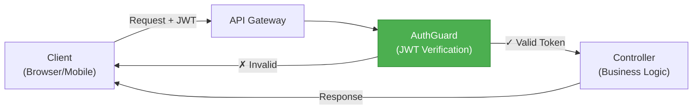
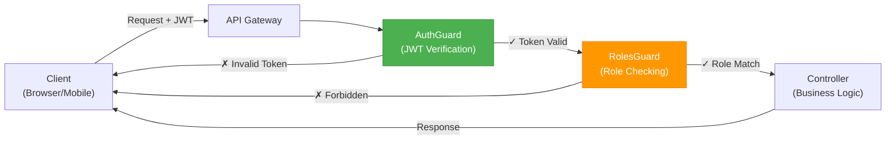
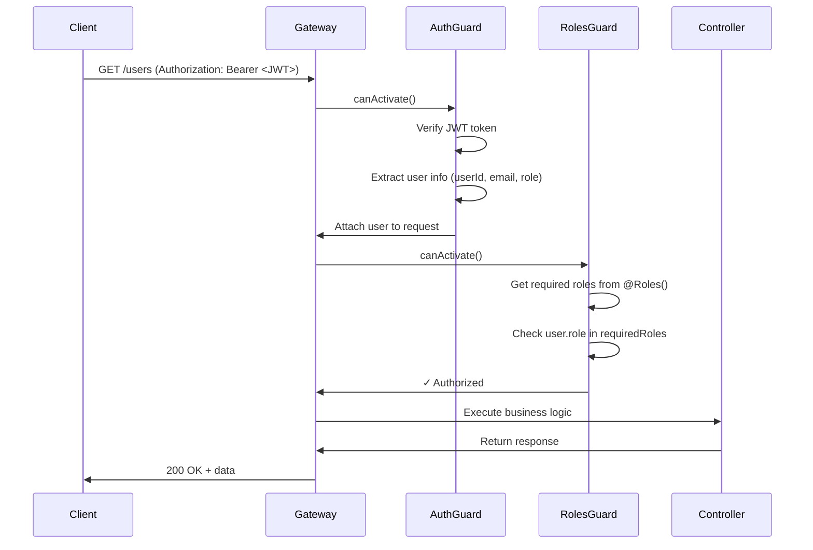
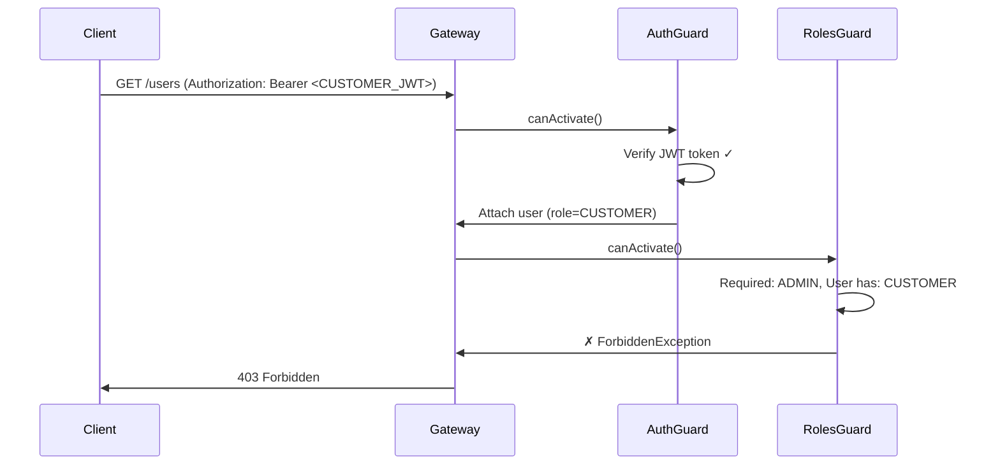

# System Design & Architecture - User Authorization

## Architecture Overview

Tính năng **User Authorization** bổ sung thêm **role-based access control (RBAC)** vào hệ thống hiện tại. Kiến trúc sẽ mở rộng từ authentication hiện tại (JWT verification) sang authorization (role checking).

### Current State (Authentication Only)



**Vấn đề**: AuthGuard chỉ verify token, không check role → tất cả authenticated users đều truy cập được mọi endpoint.

### New State (Authentication + Authorization)



**Giải pháp**: Thêm `RolesGuard` sau `AuthGuard` để kiểm tra role từ JWT payload.

## Component Design

### 1. RolesGuard

**Location**: `apps/gateway/src/auth/roles.guard.ts`

**Responsibility**: Kiểm tra xem user có role phù hợp để truy cập endpoint không

**Implementation**:

```typescript
import { Injectable, CanActivate, ExecutionContext, ForbiddenException } from '@nestjs/common';
import { Reflector } from '@nestjs/core';
import { UserRole } from '@shared/dto/user.dto';
import { ROLES_KEY } from './roles.decorator';

@Injectable()
export class RolesGuard implements CanActivate {
  constructor(private reflector: Reflector) {}

  canActivate(context: ExecutionContext): boolean {
    // 1. Lấy roles yêu cầu từ decorator @Roles()
    const requiredRoles = this.reflector.getAllAndOverride<UserRole[]>(ROLES_KEY, [
      context.getHandler(),
      context.getClass(),
    ]);

    // 2. Nếu không có @Roles() decorator → cho phép truy cập (chỉ cần authentication)
    if (!requiredRoles || requiredRoles.length === 0) {
      return true;
    }

    // 3. Lấy user từ request (đã được AuthGuard attach vào)
    const request = context.switchToHttp().getRequest();
    const user = request.user;

    // 4. Kiểm tra user có role phù hợp không
    if (!user || !user.role) {
      throw new ForbiddenException('User role not found');
    }

    // 5. Check if user's role matches any required roles
    const hasRole = requiredRoles.includes(user.role);

    if (!hasRole) {
      throw new ForbiddenException(
        `Access denied. Required roles: ${requiredRoles.join(', ')}. Your role: ${user.role}`,
      );
    }

    return true;
  }
}
```

**Key Design Decisions**:

- ✅ **Sử dụng NestJS Reflector**: Để đọc metadata từ `@Roles()` decorator
- ✅ **Fallback to authentication-only**: Nếu không có `@Roles()` → chỉ cần token hợp lệ
- ✅ **Clear error messages**: Message rõ ràng cho developer debug
- ✅ **No side effects**: Guard chỉ check, không modify request

### 2. @Roles() Decorator

**Location**: `apps/gateway/src/auth/roles.decorator.ts`

**Responsibility**: Đánh dấu endpoint cần role gì

**Implementation**:

````typescript
import { SetMetadata } from '@nestjs/common';
import { UserRole } from '@shared/dto/user.dto';

export const ROLES_KEY = 'roles';

/**
 * Decorator để chỉ định roles được phép truy cập endpoint
 *
 * @example
 * ```typescript
 * @Roles(UserRole.ADMIN)
 * @Get('users')
 * async listAllUsers() { ... }
 *
 * @Roles(UserRole.ADMIN, UserRole.CUSTOMER)
 * @Get('products')
 * async listProducts() { ... }
 * ```
 */
export const Roles = (...roles: UserRole[]) => SetMetadata(ROLES_KEY, roles);
````

**Key Design Decisions**:

- ✅ **Type-safe**: Chỉ chấp nhận `UserRole` enum
- ✅ **Flexible**: Có thể chỉ định nhiều roles (OR logic)
- ✅ **Simple API**: Syntax đơn giản, dễ nhớ

### 3. Integration with AuthGuard

**Location**: Controllers trong `apps/gateway/src/`

**Pattern**: Sử dụng cả 2 guards cùng nhau

**Implementation Example**:

```typescript
import { Controller, Get, Post, UseGuards } from '@nestjs/common';
import { AuthGuard } from './auth/auth.guard';
import { RolesGuard } from './auth/roles.guard';
import { Roles } from './auth/roles.decorator';
import { UserRole } from '@shared/dto/user.dto';

@Controller('users')
@UseGuards(AuthGuard, RolesGuard) // ← Apply both guards to all endpoints
export class UsersController {
  // Admin-only endpoint
  @Post()
  @Roles(UserRole.ADMIN)
  async createUser() {
    // Only ADMIN can create users
  }

  // Admin-only endpoint
  @Get()
  @Roles(UserRole.ADMIN)
  async listAllUsers() {
    // Only ADMIN can list all users
  }

  // Authenticated endpoint (no role check)
  @Get('me')
  async getMyProfile() {
    // Any authenticated user can access
  }
}
```

**Guard Execution Order**:

1. **AuthGuard** → Verify JWT token, attach `user` to request
2. **RolesGuard** → Check if `user.role` matches `@Roles()` requirement

**Why this order?**

- RolesGuard depends on `request.user` from AuthGuard
- Fail fast: Invalid token → 401, Valid token but wrong role → 403

## Data Flow

### Successful Authorization Flow



### Failed Authorization Flow (Wrong Role)



## API Design

### Error Responses

#### 401 Unauthorized (Authentication Failed)

```json
{
  "statusCode": 401,
  "message": "Invalid or expired token",
  "error": "Unauthorized"
}
```

**Triggers**:

- No Authorization header
- Invalid JWT token
- Expired token
- Missing required JWT fields (sub, email, role)

#### 403 Forbidden (Authorization Failed)

```json
{
  "statusCode": 403,
  "message": "Access denied. Required roles: ADMIN. Your role: CUSTOMER",
  "error": "Forbidden"
}
```

**Triggers**:

- Valid token but wrong role
- User role not in allowed roles list

## Usage Examples

### Example 1: Admin-Only Endpoint

```typescript
@Controller('products')
@UseGuards(AuthGuard, RolesGuard)
export class ProductsController {
  @Post()
  @Roles(UserRole.ADMIN)
  async createProduct(@Body() dto: CreateProductDto) {
    // Only ADMIN can create products
    return this.productService.create(dto);
  }
}
```

### Example 2: Multiple Roles Allowed

```typescript
@Controller('products')
@UseGuards(AuthGuard, RolesGuard)
export class ProductsController {
  @Get()
  @Roles(UserRole.ADMIN, UserRole.CUSTOMER)
  async listProducts() {
    // Both ADMIN and CUSTOMER can list products
    return this.productService.findAll();
  }
}
```

### Example 3: Authentication Only (No Role Check)

```typescript
@Controller('users')
@UseGuards(AuthGuard, RolesGuard)
export class UsersController {
  @Get('me')
  // No @Roles() decorator → only authentication required
  async getMyProfile(@Request() req) {
    return this.userService.findById(req.user.userId);
  }
}
```

### Example 4: Public Endpoint (No Guards)

```typescript
@Controller('products')
export class ProductsController {
  @Get(':id')
  // No guards → public access
  async getProductById(@Param('id') id: string) {
    return this.productService.findById(id);
  }
}
```

## Security Considerations

### 1. JWT Payload Trust

**Assumption**: JWT payload (including `role` field) is trusted because:

- JWT signed by User Service với RSA private key
- AuthGuard verified signature với RSA public key
- Payload không thể bị tamper mà không invalidate signature

**Risk Mitigation**:

- ✅ Sử dụng RSA (asymmetric) thay vì HS256 (symmetric)
- ✅ Private key chỉ có User Service biết
- ✅ Public key được shared an toàn

### 2. Role Changes During Token Lifetime

**Scenario**: Admin demote 1 user từ ADMIN → CUSTOMER, nhưng user vẫn còn valid ADMIN token

**Current Behavior**: User vẫn có quyền ADMIN cho đến khi token expire

**Mitigation Options**:

- ❌ Real-time role check (gọi User Service mỗi request) → **Không làm** (quá chậm)
- ✅ Short-lived access tokens (15 phút) → **Đã có sẵn**
- ✅ Token revocation list (future enhancement) → **Out of scope**

**Decision**: Accept risk. Token expiry trong 15 phút là acceptable trade-off.

### 3. Authorization vs Resource Ownership

**Out of Scope**: RolesGuard chỉ check role, không check ownership

**Example**:

- CUSTOMER có thể gọi `GET /orders/:id`
- RolesGuard chỉ check user là CUSTOMER → OK
- Nhưng KHÔNG check order có thuộc về user không

**Solution**: Business logic trong controller/service phải check ownership

```typescript
@Get(':id')
@Roles(UserRole.CUSTOMER)
async getOrder(@Param('id') id: string, @Request() req) {
  const order = await this.orderService.findById(id);

  // Check ownership
  if (order.userId !== req.user.userId) {
    throw new ForbiddenException('You can only view your own orders');
  }

  return order;
}
```

## Performance Considerations

### Guard Performance

**AuthGuard**:

- JWT verification: ~1-2ms (RSA signature verification)
- Attach user to request: negligible

**RolesGuard**:

- Reflector.getAllAndOverride: ~0.1ms (metadata lookup)
- Array.includes check: negligible
- **Total overhead**: ~0.1ms per request

**Conclusion**: Performance impact minimal, acceptable.

### Caching Considerations

**Not needed**: Role check quá nhanh, không cần cache.

## Testing Strategy

### Unit Tests

1. **RolesGuard Unit Tests**:
   - ✅ No @Roles() decorator → allow access
   - ✅ User role matches required role → allow
   - ✅ User role doesn't match → 403 Forbidden
   - ✅ Multiple roles, user has one → allow
   - ✅ User role missing from request → 403 Forbidden

2. **@Roles() Decorator Tests**:
   - ✅ Metadata được set đúng
   - ✅ Multiple roles được lưu đúng

### Integration Tests

1. **AuthGuard + RolesGuard Integration**:
   - ✅ No token → 401 Unauthorized (AuthGuard)
   - ✅ Invalid token → 401 Unauthorized (AuthGuard)
   - ✅ Valid CUSTOMER token + ADMIN endpoint → 403 Forbidden (RolesGuard)
   - ✅ Valid ADMIN token + ADMIN endpoint → 200 OK

### E2E Tests

1. **Gateway E2E Tests**:
   - ✅ Test tất cả các use cases trong requirements
   - ✅ Test với real JWT tokens
   - ✅ Test error messages

## Migration Guide

### Step 1: Tạo RolesGuard và @Roles() decorator

- Tạo `apps/gateway/src/auth/roles.guard.ts`
- Tạo `apps/gateway/src/auth/roles.decorator.ts`

### Step 2: Viết tests

- Unit tests cho RolesGuard
- Integration tests cho AuthGuard + RolesGuard

### Step 3: Update existing controllers

**Identify endpoints cần authorization**:

- ✅ ADMIN-only:
  - User management: `POST /users`, `PATCH /users/:id`, `GET /users`
  - Product management: `POST /products`, `PATCH /products/:id`, `DELETE /products/:id`
  - Category management: `POST /categories`, `PATCH /categories/:id`, `DELETE /categories/:id`
  - Order management: `PATCH /orders/:id/status`

- ✅ CUSTOMER-only:
  - Cart operations: `POST /cart/items`, `DELETE /cart/items/:id`
  - Orders: `POST /orders`, `GET /orders/:id`

- ✅ Both ADMIN & CUSTOMER:
  - Product listing: `GET /products`
  - Category listing: `GET /categories`

### Step 4: Documentation

- Update README với usage examples
- Tạo migration checklist cho developer

## Alternative Designs Considered

### Alternative 1: Single Guard (AuthGuard + RolesGuard merged)

**Pros**:

- Simpler usage (only 1 guard)

**Cons**:

- Violates single responsibility principle
- Harder to test
- Less flexible (can't use AuthGuard without RolesGuard)

**Decision**: ❌ Rejected. Separation of concerns better.

### Alternative 2: Permission-Based Authorization

**Example**: `@Permissions('user:create', 'user:update')`

**Pros**:

- More fine-grained control
- Flexible (can add new permissions without code change)

**Cons**:

- Overkill cho current requirements (chỉ 2 roles)
- Complexity tăng đáng kể
- Cần thêm Permission management UI

**Decision**: ❌ Rejected. Too complex for current needs. YAGNI.

### Alternative 3: CASL (Authorization Library)

**Pros**:

- Battle-tested library
- Supports complex rules (role + ownership)

**Cons**:

- External dependency
- Learning curve
- Overkill cho simple role-based auth

**Decision**: ❌ Rejected. Keep it simple, build in-house.

## Open Questions

### Resolved

✅ **Q1**: Guard order matters?

- **A**: Yes. AuthGuard must run before RolesGuard.

✅ **Q2**: Có nên làm global guards?

- **A**: No. Let developers choose which controllers need authorization.

### Unresolved

❓ **Q3**: Có nên log failed authorization attempts?

- **Decision**: Làm trong implementation phase nếu có thời gian
