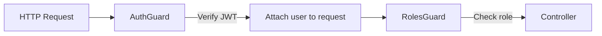

# Implementation Guide - User Authorization

## Development Setup

**How do we get started?**

### Prerequisites

- ✅ Node.js 18+ và pnpm installed
- ✅ NestJS 11 (already in project)
- ✅ TypeScript 5.7 (already configured)
- ✅ Existing `AuthGuard` implementation
- ✅ `UserRole` enum trong `libs/shared/dto/user.dto.ts`

### Environment Setup

1. **Clone repository** (if not already):

   ```bash
   cd /home/hao/Desktop/luan-van/backend-luan-van
   ```

2. **Install dependencies** (if needed):

   ```bash
   pnpm install
   ```

3. **Verify existing auth infrastructure**:

   ```bash
   # Check AuthGuard exists
   cat apps/gateway/src/auth/auth.guard.ts

   # Check UserRole enum exists
   cat libs/shared/dto/user.dto.ts
   ```

## Code Structure

**How is the code organized?**

### File Structure

```
apps/gateway/src/auth/
├── auth.guard.ts           # Existing - JWT authentication
├── roles.guard.ts          # NEW - Role authorization
├── roles.decorator.ts      # NEW - @Roles() decorator
└── index.ts                # Optional - Barrel exports
```

### Module Organization

```typescript
// apps/gateway/src/app.module.ts
@Module({
  imports: [
    // ... existing imports
  ],
  controllers: [
    // Controllers sẽ import AuthGuard và RolesGuard trực tiếp
  ],
  providers: [
    // Guards không cần register ở đây (per-controller usage)
  ],
})
```

## Implementation Notes

**Key technical details to remember:**

### Core Component 1: @Roles() Decorator

**File**: `apps/gateway/src/auth/roles.decorator.ts`

````typescript
import { SetMetadata } from '@nestjs/common';
import { UserRole } from '@shared/dto/user.dto';

/**
 * Metadata key để lưu required roles
 * Được sử dụng bởi RolesGuard để retrieve metadata
 */
export const ROLES_KEY = 'roles';

/**
 * Decorator để chỉ định roles được phép truy cập endpoint
 *
 * @param roles - Một hoặc nhiều UserRole values
 *
 * @example Single role
 * ```typescript
 * @Roles(UserRole.ADMIN)
 * @Post('users')
 * async createUser() { }
 * ```
 *
 * @example Multiple roles (OR logic)
 * ```typescript
 * @Roles(UserRole.ADMIN, UserRole.CUSTOMER)
 * @Get('products')
 * async listProducts() { }
 * ```
 */
export const Roles = (...roles: UserRole[]) => SetMetadata(ROLES_KEY, roles);
````

**Key Points**:

- ✅ Type-safe: Chỉ chấp nhận `UserRole` enum
- ✅ Variadic parameters: Có thể pass nhiều roles
- ✅ Uses NestJS `SetMetadata`: Standard approach
- ✅ Clear JSDoc: Giúp IDE autocomplete

### Core Component 2: RolesGuard

**File**: `apps/gateway/src/auth/roles.guard.ts`

````typescript
import { Injectable, CanActivate, ExecutionContext, ForbiddenException } from '@nestjs/common';
import { Reflector } from '@nestjs/core';
import { UserRole } from '@shared/dto/user.dto';
import { ROLES_KEY } from './roles.decorator';

/**
 * Authorization Guard - Kiểm tra user có role phù hợp
 *
 * QUAN TRỌNG: Guard này phải được sử dụng CÙNG VỚI AuthGuard
 * và AuthGuard phải chạy TRƯỚC để attach user vào request
 *
 * @example
 * ```typescript
 * @Controller('users')
 * @UseGuards(AuthGuard, RolesGuard)  // ← Đúng order!
 * export class UsersController { }
 * ```
 */
@Injectable()
export class RolesGuard implements CanActivate {
  constructor(private reflector: Reflector) {}

  canActivate(context: ExecutionContext): boolean {
    // Step 1: Lấy required roles từ @Roles() decorator
    // getAllAndOverride checks both method and class decorators
    const requiredRoles = this.reflector.getAllAndOverride<UserRole[]>(ROLES_KEY, [
      context.getHandler(), // Method-level decorator
      context.getClass(), // Class-level decorator
    ]);

    // Step 2: Nếu không có @Roles() decorator → allow access
    // Endpoint chỉ cần authentication, không cần authorization
    if (!requiredRoles || requiredRoles.length === 0) {
      return true;
    }

    // Step 3: Lấy user từ request (đã được AuthGuard attach)
    const request = context.switchToHttp().getRequest();
    const user = request.user;

    // Step 4: Validate user existence và role field
    if (!user) {
      throw new ForbiddenException(
        'User not found in request. Did you apply AuthGuard before RolesGuard?',
      );
    }

    if (!user.role) {
      throw new ForbiddenException('User role not found in token payload');
    }

    // Step 5: Check if user's role matches any required roles (OR logic)
    const hasRequiredRole = requiredRoles.includes(user.role);

    if (!hasRequiredRole) {
      throw new ForbiddenException(
        `Access denied. Required roles: [${requiredRoles.join(', ')}]. Your role: ${user.role}`,
      );
    }

    // Step 6: Authorization successful
    return true;
  }
}
````

**Key Points**:

- ✅ Clear error messages: Giúp debug dễ dàng
- ✅ Fallback behavior: No decorator → authentication only
- ✅ Validates prerequisites: Check `user` và `user.role` exist
- ✅ OR logic: User chỉ cần match 1 trong các required roles

### Patterns & Best Practices

#### Pattern 1: Controller-Level Guards (Recommended)

```typescript
import { Controller, Get, Post, UseGuards } from '@nestjs/common';
import { AuthGuard } from './auth/auth.guard';
import { RolesGuard } from './auth/roles.guard';
import { Roles } from './auth/roles.decorator';
import { UserRole } from '@shared/dto/user.dto';

/**
 * Apply guards ở class level → áp dụng cho TẤT CẢ endpoints
 */
@Controller('users')
@UseGuards(AuthGuard, RolesGuard) // ← Both guards for all methods
export class UsersController {
  // ADMIN-only endpoint
  @Post()
  @Roles(UserRole.ADMIN)
  async createUser() {}

  // ADMIN-only endpoint
  @Get()
  @Roles(UserRole.ADMIN)
  async listAllUsers() {}

  // Any authenticated user (no role check)
  @Get('me')
  // No @Roles() decorator
  async getMyProfile() {}
}
```

**Advantages**:

- ✅ DRY: Không lặp lại `@UseGuards()` cho mỗi method
- ✅ Consistent: Tất cả endpoints đều có authentication
- ✅ Safe default: Phải explicitly add `@Roles()` để restrict

#### Pattern 2: Method-Level Guards (Granular Control)

```typescript
@Controller('products')
export class ProductsController {
  // Public endpoint (no guards)
  @Get(':id')
  async getProduct(@Param('id') id: string) {}

  // Admin-only endpoint
  @Post()
  @UseGuards(AuthGuard, RolesGuard)
  @Roles(UserRole.ADMIN)
  async createProduct() {}

  // Authenticated endpoint (no role check)
  @Get('favorites')
  @UseGuards(AuthGuard)
  async getFavorites() {}
}
```

**When to use**:

- Mix of public and protected endpoints
- Different guards for different methods
- More verbose but more explicit

#### Pattern 3: Multiple Roles (OR Logic)

```typescript
@Controller('reports')
@UseGuards(AuthGuard, RolesGuard)
export class ReportsController {
  // Both ADMIN and CUSTOMER can access
  @Get('sales')
  @Roles(UserRole.ADMIN, UserRole.CUSTOMER)
  async getSalesReport() {
    // Business logic might differ based on role
    // Check inside method if needed
  }
}
```

#### Pattern 4: No Authorization (Authentication Only)

```typescript
@Controller('profile')
@UseGuards(AuthGuard, RolesGuard)
export class ProfileController {
  // No @Roles() decorator → only authentication required
  @Get()
  async getProfile(@Request() req) {
    // req.user available from AuthGuard
    return this.userService.findById(req.user.userId);
  }
}
```

## Integration Points

**How do pieces connect?**

### Integration 1: AuthGuard → RolesGuard



**Key Integration Points**:

1. **AuthGuard** extracts user info from JWT:

   ```typescript
   request['user'] = {
     userId: payload.sub,
     email: payload.email,
     role: payload.role, // ← RolesGuard needs this
   };
   ```

2. **RolesGuard** reads from request:

   ```typescript
   const user = request.user; // ← Set by AuthGuard
   const hasRole = requiredRoles.includes(user.role);
   ```

3. **Controller** receives authorized request:
   ```typescript
   @Get('admin-only')
   @Roles(UserRole.ADMIN)
   async adminMethod(@Request() req) {
     // req.user.role is guaranteed to be ADMIN
   }
   ```

### Integration 2: JWT Payload Structure

**JWT Payload** (created by User Service):

```json
{
  "sub": "user-id-123",
  "email": "user@example.com",
  "role": "ADMIN",
  "iat": 1634567890,
  "exp": 1634571490
}
```

**Request User Object** (attached by AuthGuard):

```typescript
interface RequestUser {
  userId: string; // from payload.sub
  email: string; // from payload.email
  role: string; // from payload.role ← Used by RolesGuard
}
```

**Validation Chain**:

1. User Service signs JWT với `role` field
2. AuthGuard verifies signature và validates `role` exists
3. RolesGuard checks `user.role` matches `@Roles()` requirement

## Error Handling

**How do we handle failures?**

### Error Types

#### 1. Authentication Errors (401 Unauthorized)

**Thrown by**: `AuthGuard`

**Scenarios**:

- No Authorization header
- Invalid JWT token
- Expired token
- Missing required JWT fields

**Response**:

```json
{
  "statusCode": 401,
  "message": "Invalid or expired token",
  "error": "Unauthorized"
}
```

#### 2. Authorization Errors (403 Forbidden)

**Thrown by**: `RolesGuard`

**Scenarios**:

- User role doesn't match required roles
- Missing `user.role` in request

**Response**:

```json
{
  "statusCode": 403,
  "message": "Access denied. Required roles: [ADMIN]. Your role: CUSTOMER",
  "error": "Forbidden"
}
```

### Error Handling Strategy

```typescript
// RolesGuard error handling
try {
  // Authorization logic
} catch (error) {
  // Re-throw with clear message
  throw new ForbiddenException(`Access denied. Required: [${requiredRoles}], Got: ${user.role}`);
}
```

**Best Practices**:

- ✅ Clear error messages for debugging
- ✅ Don't expose sensitive info (e.g., other users' data)
- ✅ Consistent error format (NestJS default)
- ✅ Log errors for audit (optional enhancement)

## Performance Considerations

**How do we keep it fast?**

### Performance Analysis

| Operation                       | Time        | Impact          |
| ------------------------------- | ----------- | --------------- |
| Reflector.getAllAndOverride     | ~0.05ms     | Negligible      |
| Array.includes (role check)     | ~0.01ms     | Negligible      |
| Throw exception (if auth fails) | ~0.1ms      | Only on failure |
| **Total RolesGuard overhead**   | **~0.06ms** | **Minimal**     |

### Optimization Strategies

#### 1. No Caching Needed

**Why**: Role check quá nhanh (~0.06ms), caching sẽ phức tạp hơn benefit

**Decision**: Don't optimize prematurely

#### 2. Guard Order Optimization

**Current**:

```typescript
@UseGuards(AuthGuard, RolesGuard)
```

**Why this order**:

- AuthGuard fail → 401 (most common failure)
- No need to run RolesGuard if authentication fails
- **Fail fast pattern**

#### 3. Metadata Lookup Optimization

**NestJS Reflector**: Đã được optimize internally

- Metadata cache by NestJS
- O(1) lookup time

#### 4. Role Enum vs String Comparison

**Current**: Sử dụng enum `UserRole`

```typescript
export enum UserRole {
  ADMIN = 'ADMIN',
  CUSTOMER = 'CUSTOMER',
}
```

**Why**:

- Type-safe at compile time
- String comparison at runtime (fast)
- No performance difference vs plain strings

## Security Notes

**What security measures are in place?**

### Security Principles

#### 1. Defense in Depth

```
Layer 1: Network (Firewall, HTTPS)
Layer 2: Authentication (AuthGuard - JWT verification)
Layer 3: Authorization (RolesGuard - Role checking) ← NEW
Layer 4: Business Logic (Ownership checks in controllers)
```

#### 2. Principle of Least Privilege

- Default: No access (no guards = maybe public endpoint)
- Explicit opt-in: Must add `@Roles()` to allow access
- No implicit permissions: ADMIN doesn't auto-get CUSTOMER permissions

#### 3. Trust Boundary

**Trusted**:

- ✅ JWT signature (verified by AuthGuard)
- ✅ JWT payload including `role` field
- ✅ NestJS framework internals

**Untrusted**:

- ❌ Client-provided data (body, query, params)
- ❌ External API responses
- ❌ User input

### Security Best Practices

#### 1. Input Validation

```typescript
// DTOs already have validation
export class CreateUserDto {
  @IsEnum(UserRole)
  role?: UserRole = UserRole.CUSTOMER;
}
```

**Defense**: Type-safe enum prevents invalid roles

#### 2. Resource Ownership Checks

```typescript
@Get(':id')
@Roles(UserRole.CUSTOMER)
async getOrder(@Param('id') id: string, @Request() req) {
  const order = await this.orderService.findById(id);

  // RolesGuard checks role = CUSTOMER ✓
  // But still need ownership check:
  if (order.userId !== req.user.userId) {
    throw new ForbiddenException('Not your order');
  }

  return order;
}
```

**Important**: RolesGuard không check ownership, chỉ check role.

#### 3. Secure Error Messages

```typescript
// ✅ Good: Clear but not leaking sensitive info
throw new ForbiddenException('Access denied. Required role: ADMIN');

// ❌ Bad: Leaking user info
throw new ForbiddenException(`User ${user.email} is not admin`);
```

#### 4. Audit Logging (Optional Enhancement)

```typescript
@Injectable()
export class RolesGuard implements CanActivate {
  constructor(
    private reflector: Reflector,
    private logger: Logger, // ← Add logging
  ) {}

  canActivate(context: ExecutionContext): boolean {
    // ... authorization logic ...

    if (!hasRequiredRole) {
      // Log failed authorization
      this.logger.warn(
        `Authorization failed: User ${user.userId} (${user.role}) ` +
          `tried to access endpoint requiring [${requiredRoles}]`,
      );
      throw new ForbiddenException('Access denied');
    }
  }
}
```

### Known Security Limitations

#### 1. Token Lifetime Window

**Issue**: User role thay đổi nhưng token vẫn valid
**Impact**: User có thể giữ quyền cũ tối đa 15 phút (access token expiry)
**Mitigation**: Short-lived tokens (15 min), accepted trade-off

#### 2. No Permission-Level Authorization

**Issue**: Chỉ có role-based, không có fine-grained permissions
**Impact**: Không thể restrict specific actions (e.g., "user:create" vs "user:read")
**Mitigation**: Out of scope. Implement later if needed.

#### 3. No Real-Time Role Revocation

**Issue**: Không thể revoke token ngay lập tức
**Impact**: Fired admin vẫn có access đến hết token expiry
**Mitigation**: Manual intervention (change keys, restart services) for critical cases

## Common Patterns & Examples

### Example 1: User Management (ADMIN-only)

```typescript
@Controller('users')
@UseGuards(AuthGuard, RolesGuard)
export class UsersController {
  @Post()
  @Roles(UserRole.ADMIN)
  async createUser(@Body() dto: CreateUserDto) {
    return this.userService.create(dto);
  }

  @Get()
  @Roles(UserRole.ADMIN)
  async listUsers(@Query() query: ListUsersDto) {
    return this.userService.findAll(query);
  }

  @Patch(':id')
  @Roles(UserRole.ADMIN)
  async updateUser(@Param('id') id: string, @Body() dto: UpdateUserDto) {
    return this.userService.update(id, dto);
  }
}
```

### Example 2: Mixed Permissions

```typescript
@Controller('products')
@UseGuards(AuthGuard, RolesGuard)
export class ProductsController {
  // Public (no guards on this method)
  @Get(':id')
  @Public() // Custom decorator to skip guards
  async getProduct(@Param('id') id: string) {}

  // Both roles can access
  @Get()
  @Roles(UserRole.ADMIN, UserRole.CUSTOMER)
  async listProducts() {}

  // ADMIN-only
  @Post()
  @Roles(UserRole.ADMIN)
  async createProduct() {}
}
```

### Example 3: Resource Ownership

```typescript
@Controller('orders')
@UseGuards(AuthGuard, RolesGuard)
export class OrdersController {
  @Get(':id')
  @Roles(UserRole.CUSTOMER, UserRole.ADMIN)
  async getOrder(@Param('id') id: string, @Request() req) {
    const order = await this.orderService.findById(id);

    // ADMIN can see all orders
    if (req.user.role === UserRole.ADMIN) {
      return order;
    }

    // CUSTOMER can only see their own
    if (order.userId !== req.user.userId) {
      throw new ForbiddenException('Not your order');
    }

    return order;
  }
}
```

## Testing Guidelines

### Unit Testing RolesGuard

```typescript
describe('RolesGuard', () => {
  let guard: RolesGuard;
  let reflector: Reflector;

  beforeEach(() => {
    reflector = new Reflector();
    guard = new RolesGuard(reflector);
  });

  it('should allow access when no @Roles() decorator', () => {
    jest.spyOn(reflector, 'getAllAndOverride').mockReturnValue(undefined);

    const context = createMockContext({ user: { role: 'CUSTOMER' } });
    expect(guard.canActivate(context)).toBe(true);
  });

  it('should allow access when user role matches', () => {
    jest.spyOn(reflector, 'getAllAndOverride').mockReturnValue([UserRole.ADMIN]);

    const context = createMockContext({ user: { role: 'ADMIN' } });
    expect(guard.canActivate(context)).toBe(true);
  });

  it('should deny access when user role does not match', () => {
    jest.spyOn(reflector, 'getAllAndOverride').mockReturnValue([UserRole.ADMIN]);

    const context = createMockContext({ user: { role: 'CUSTOMER' } });
    expect(() => guard.canActivate(context)).toThrow(ForbiddenException);
  });
});
```

## Troubleshooting

### Issue 1: "User not found in request"

**Cause**: RolesGuard chạy trước AuthGuard

**Solution**:

```typescript
// ❌ Wrong order
@UseGuards(RolesGuard, AuthGuard)

// ✅ Correct order
@UseGuards(AuthGuard, RolesGuard)
```

### Issue 2: "Access denied" nhưng token hợp lệ

**Cause**: User role không match required role

**Debug**:

```typescript
console.log('User role:', req.user.role);
console.log('Required roles:', requiredRoles);
```

**Solution**: Check if `@Roles()` decorator đúng

### Issue 3: RolesGuard không chạy

**Cause**: Quên apply guard

**Solution**:

```typescript
// Add guards to controller
@UseGuards(AuthGuard, RolesGuard)
```
