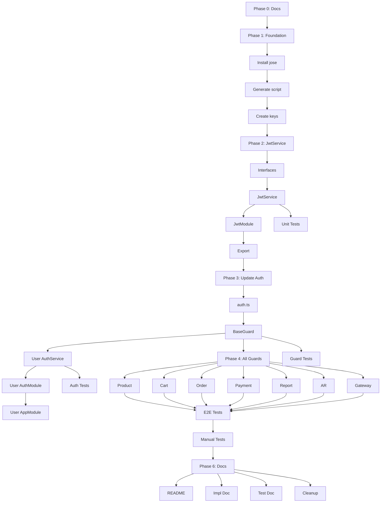

# Project Planning & Task Breakdown - JWT Migration to Jose with RSA

## Milestones

- [x] **M1: Documentation Phase** - Requirements, Design, Planning docs hoàn thành
- [ ] **M2: Foundation Setup** - Script generate keys, install dependencies, create base structures
- [ ] **M3: Core Implementation** - JwtService, update auth logic, update guards
- [ ] **M4: Testing & Validation** - Unit tests, integration tests, E2E tests
- [ ] **M5: Deployment Ready** - Environment setup, documentation finalized

---

## Task Breakdown

### ✅ Phase 0: Documentation (COMPLETED)

**Goal**: Tạo đầy đủ tài liệu theo workflow

- [x] **Task 0.1**: Tạo `docs/ai/requirements/feature-jwt-migration.md`
- [x] **Task 0.2**: Tạo `docs/ai/design/feature-jwt-migration.md`
- [x] **Task 0.3**: Tạo `docs/ai/planning/feature-jwt-migration.md`

**Estimated Time**: 1 hour  
**Actual Time**: 1 hour  
**Status**: ✅ DONE

---

### 🔧 Phase 1: Foundation Setup

**Goal**: Cài đặt dependencies và tạo script generate keys

#### Task 1.1: Update package.json dependencies

**Description**: Thêm `jose` và remove `jsonwebtoken`, `@types/jsonwebtoken`

**Steps**:

1. Add `jose` to dependencies
2. Remove `jsonwebtoken` and `@types/jsonwebtoken`
3. Run `pnpm install`

**Files Changed**:

- `package.json`

**Estimated Time**: 5 minutes  
**Dependencies**: None

---

#### Task 1.2: Create key generation script

**Description**: Tạo script `scripts/generate-keys.ts` để generate RSA keys

**Steps**:

1. Create `scripts/generate-keys.ts`
2. Implement RSA key generation với `jose.generateKeyPair()`
3. Export keys to PEM format
4. Encode to base64 và output cho .env
5. Add script command to `package.json`: `"generate:keys": "tsx scripts/generate-keys.ts"`

**Files Created**:

- `scripts/generate-keys.ts`

**Files Changed**:

- `package.json` (scripts section)

**Estimated Time**: 20 minutes  
**Dependencies**: Task 1.1

---

#### Task 1.3: Generate keys and update .env

**Description**: Chạy script và cập nhật `.env` với keys mới

**Steps**:

1. Run `pnpm run generate:keys`
2. Copy output vào `.env` file
3. Update `.env.example` với template (không có actual keys)

**Files Changed**:

- `.env` (local only, not committed)
- `.env.example`

**Estimated Time**: 10 minutes  
**Dependencies**: Task 1.2

---

### 🏗️ Phase 2: Core JWT Service Implementation

**Goal**: Tạo shared JwtService module

#### Task 2.1: Create JwtService interfaces

**Description**: Define TypeScript interfaces cho JWT

**Steps**:

1. Create `libs/shared/jwt/interfaces.ts`
2. Export `JwtPayload` interface (move from auth.ts)
3. Export `JwtConfig` interface nếu cần

**Files Created**:

- `libs/shared/jwt/interfaces.ts`

**Estimated Time**: 10 minutes  
**Dependencies**: None

---

#### Task 2.2: Implement JwtService

**Description**: Core service for signing và verifying tokens

**Steps**:

1. Create `libs/shared/jwt/jwt.service.ts`
2. Implement `onModuleInit()` - load keys from env
3. Implement `signToken()` - sign với private key
4. Implement `verifyToken()` - verify với public key
5. Implement `decodeToken()` - decode without verify (debug)
6. Add proper error handling với `jose.errors`

**Files Created**:

- `libs/shared/jwt/jwt.service.ts`

**Estimated Time**: 45 minutes  
**Dependencies**: Task 2.1

---

#### Task 2.3: Create JwtModule

**Description**: NestJS module wrapper cho JwtService

**Steps**:

1. Create `libs/shared/jwt/jwt.module.ts`
2. Mark as `@Global()` để available everywhere
3. Export JwtService

**Files Created**:

- `libs/shared/jwt/jwt.module.ts`

**Estimated Time**: 10 minutes  
**Dependencies**: Task 2.2

---

#### Task 2.4: Export from shared/main.ts

**Description**: Re-export JwtService và interfaces

**Steps**:

1. Update `libs/shared/main.ts`
2. Export JwtService, JwtModule, JwtPayload

**Files Changed**:

- `libs/shared/main.ts`

**Estimated Time**: 5 minutes  
**Dependencies**: Task 2.3

---

### 🔄 Phase 3: Update Existing Auth Code

**Goal**: Migrate existing code to use JwtService

#### Task 3.1: Update libs/shared/auth.ts

**Description**: Keep wrapper functions but delegate to JwtService

**Steps**:

1. Import JwtService
2. Create singleton pattern hoặc service locator
3. Update `verifyJwtFromHeader()` to use JwtService
4. Update `generateJwt()` to use JwtService
5. Keep `JwtPayload` export for backwards compatibility

**Files Changed**:

- `libs/shared/auth.ts`

**Estimated Time**: 30 minutes  
**Dependencies**: Task 2.4

---

#### Task 3.2: Update BaseAuthGuard

**Description**: Inject JwtService và use it for verification

**Steps**:

1. Update `libs/shared/guards/base-auth.guard.ts`
2. Add JwtService injection in constructor
3. Replace `verifyJwtFromHeader()` với direct `jwtService.verifyToken()`
4. Keep same interface và behavior

**Files Changed**:

- `libs/shared/guards/base-auth.guard.ts`

**Estimated Time**: 25 minutes  
**Dependencies**: Task 3.1

---

#### Task 3.3: Update User-App Auth Service (Sign tokens)

**Description**: User-app sử dụng JwtService để sign tokens với private key

**Steps**:

1. Update `apps/user-app/src/auth/auth.service.ts`
2. Inject JwtService in constructor
3. Replace `jwt.sign()` với `jwtService.signToken()`
4. Update login(), refresh() methods
5. Ensure expiration logic hoạt động đúng

**Files Changed**:

- `apps/user-app/src/auth/auth.service.ts`

**Estimated Time**: 30 minutes  
**Dependencies**: Task 3.2

---

#### Task 3.4: Update User-App Auth Module

**Description**: Import JwtModule trong user-app

**Steps**:

1. Update `apps/user-app/src/auth/auth.module.ts`
2. Import JwtModule (hoặc rely on @Global)
3. Ensure JwtService available

**Files Changed**:

- `apps/user-app/src/auth/auth.module.ts`

**Estimated Time**: 10 minutes  
**Dependencies**: Task 3.3

---

#### Task 3.5: Update User-App Module

**Description**: Import JwtModule at app level

**Steps**:

1. Update `apps/user-app/src/user-app.module.ts`
2. Add JwtModule to imports array

**Files Changed**:

- `apps/user-app/src/user-app.module.ts`

**Estimated Time**: 5 minutes  
**Dependencies**: Task 3.4

---

### 🔐 Phase 4: Update All Microservice Guards

**Goal**: Update auth guards trong tất cả 7 services còn lại

#### Task 4.1: Update Product-App Guard

**Steps**:

1. Update `apps/product-app/src/auth.guard.ts`
2. Inject JwtService in constructor
3. Update `apps/product-app/src/product-app.module.ts` - import JwtModule

**Files Changed**:

- `apps/product-app/src/auth.guard.ts`
- `apps/product-app/src/product-app.module.ts`

**Estimated Time**: 10 minutes  
**Dependencies**: Task 3.2

---

#### Task 4.2: Update Cart-App Guard

**Steps**:

1. Update `apps/cart-app/src/auth.guard.ts`
2. Inject JwtService
3. Update module

**Files Changed**:

- `apps/cart-app/src/auth.guard.ts`
- `apps/cart-app/src/cart-app.module.ts`

**Estimated Time**: 10 minutes  
**Dependencies**: Task 3.2

---

#### Task 4.3: Update Order-App Guard

**Steps**:

1. Update `apps/order-app/src/auth.guard.ts`
2. Inject JwtService
3. Update module

**Files Changed**:

- `apps/order-app/src/auth.guard.ts`
- `apps/order-app/src/order-app.module.ts`

**Estimated Time**: 10 minutes  
**Dependencies**: Task 3.2

---

#### Task 4.4: Update Payment-App Guard

**Steps**:

1. Update `apps/payment-app/src/auth.guard.ts`
2. Inject JwtService
3. Update module

**Files Changed**:

- `apps/payment-app/src/auth.guard.ts`
- `apps/payment-app/src/payment-app.module.ts`

**Estimated Time**: 10 minutes  
**Dependencies**: Task 3.2

---

#### Task 4.5: Update Report-App Guard

**Steps**:

1. Update `apps/report-app/src/auth.guard.ts`
2. Inject JwtService
3. Update module

**Files Changed**:

- `apps/report-app/src/auth.guard.ts`
- `apps/report-app/src/report-app.module.ts`

**Estimated Time**: 10 minutes  
**Dependencies**: Task 3.2

---

#### Task 4.6: Update AR-App Guard

**Steps**:

1. Update `apps/ar-app/src/auth.guard.ts`
2. Inject JwtService
3. Update module

**Files Changed**:

- `apps/ar-app/src/auth.guard.ts`
- `apps/ar-app/src/ar-app.module.ts`

**Estimated Time**: 10 minutes  
**Dependencies**: Task 3.2

---

#### Task 4.7: Update Gateway (if has auth logic)

**Steps**:

1. Check if gateway has auth guard
2. If yes, update similar to other services
3. Update module imports

**Files Changed**:

- `apps/gateway/src/app.module.ts` (import JwtModule if needed)

**Estimated Time**: 10 minutes  
**Dependencies**: Task 3.2

---

### 🧪 Phase 5: Testing

**Goal**: Ensure everything works và có test coverage

#### Task 5.1: Write JwtService unit tests

**Description**: Test core signing và verification logic

**Test Cases**:

- ✅ Should load keys successfully on init
- ✅ Should sign token with private key
- ✅ Should verify valid token with public key
- ✅ Should throw error for expired token
- ✅ Should throw error for invalid signature
- ✅ Should throw error for malformed token
- ✅ Should decode token without verification
- ✅ Should throw error if private key not loaded (for signing)

**Files Created**:

- `libs/shared/jwt/jwt.service.spec.ts`

**Estimated Time**: 45 minutes  
**Dependencies**: Task 2.2

---

#### Task 5.2: Update existing auth tests

**Description**: Fix tests that might break due to changes

**Steps**:

1. Update `apps/user-app/src/auth/auth.service.spec.ts`
2. Mock JwtService properly
3. Ensure all existing tests pass

**Files Changed**:

- `apps/user-app/src/auth/auth.service.spec.ts`

**Estimated Time**: 30 minutes  
**Dependencies**: Task 3.3, Task 5.1

---

#### Task 5.3: Update BaseAuthGuard tests

**Description**: Test guard with JwtService injection

**Steps**:

1. Check if `libs/shared/guards/base-auth.guard.spec.ts` exists
2. If not, create it
3. Test successful auth flow
4. Test failure scenarios

**Files Created/Changed**:

- `libs/shared/guards/base-auth.guard.spec.ts`

**Estimated Time**: 30 minutes  
**Dependencies**: Task 3.2

---

#### Task 5.4: Run E2E tests

**Description**: Ensure auth flow works end-to-end

**Steps**:

1. Start all services với docker-compose
2. Run existing E2E tests: `pnpm run test:e2e`
3. Test login flow
4. Test protected endpoints
5. Test token expiration
6. Fix any failing tests

**Estimated Time**: 30 minutes  
**Dependencies**: All Phase 4 tasks

---

#### Task 5.5: Manual testing

**Description**: Smoke tests cho critical flows

**Test Scenarios**:

- [ ] User can login successfully
- [ ] User receives valid JWT token
- [ ] Protected endpoints accept valid token
- [ ] Protected endpoints reject invalid token
- [ ] Token expiration works correctly
- [ ] Refresh token works

**Estimated Time**: 20 minutes  
**Dependencies**: Task 5.4

---

### 📝 Phase 6: Documentation & Cleanup

**Goal**: Finalize documentation và clean up

#### Task 6.1: Update README

**Description**: Add section về JWT migration và key generation

**Steps**:

1. Update root `README.md`
2. Add "Generating RSA Keys" section
3. Document environment variables needed

**Files Changed**:

- `README.md`

**Estimated Time**: 15 minutes  
**Dependencies**: None

---

#### Task 6.2: Create implementation doc

**Description**: Document what was actually implemented

**Steps**:

1. Create `docs/ai/implementation/feature-jwt-migration.md`
2. Document actual changes made
3. Note any deviations from design

**Files Created**:

- `docs/ai/implementation/feature-jwt-migration.md`

**Estimated Time**: 20 minutes  
**Dependencies**: All implementation tasks

---

#### Task 6.3: Create testing doc

**Description**: Document test coverage và results

**Steps**:

1. Create `docs/ai/testing/feature-jwt-migration.md`
2. List all tests written
3. Document test coverage percentage
4. Note any edge cases not tested

**Files Created**:

- `docs/ai/testing/feature-jwt-migration.md`

**Estimated Time**: 20 minutes  
**Dependencies**: Phase 5 complete

---

#### Task 6.4: Remove dead code

**Description**: Clean up unused imports và functions

**Steps**:

1. Search for `jsonwebtoken` imports → remove
2. Search for `@types/jsonwebtoken` → remove
3. Run linter: `pnpm run lint`
4. Fix any linting issues

**Estimated Time**: 15 minutes  
**Dependencies**: All implementation complete

---

## Dependencies Graph

---

## Timeline & Estimates

| Phase     | Description    | Tasks  | Estimated Time | Dependencies |
| --------- | -------------- | ------ | -------------- | ------------ |
| 0         | Documentation  | 3      | 1h             | None         |
| 1         | Foundation     | 3      | 35min          | Phase 0      |
| 2         | JwtService     | 4      | 1h 10min       | Phase 1      |
| 3         | Update Auth    | 5      | 1h 40min       | Phase 2      |
| 4         | Update Guards  | 7      | 1h 10min       | Phase 3      |
| 5         | Testing        | 5      | 2h 35min       | Phases 2-4   |
| 6         | Docs & Cleanup | 4      | 1h 10min       | Phase 5      |
| **TOTAL** |                | **31** | **~9 hours**   | Sequential   |

**Optimized with parallel work**: ~6-7 hours (nếu có tests chạy parallel)

---

## Risks & Mitigation

### Risk 1: Breaking existing tests

**Probability**: HIGH  
**Impact**: MEDIUM  
**Mitigation**:

- Update tests incrementally as code changes
- Keep backwards compatibility trong wrapper functions
- Run tests frequently during development

---

### Risk 2: Key generation errors

**Probability**: LOW  
**Impact**: HIGH (blocking)  
**Mitigation**:

- Test key generation script thoroughly first
- Provide clear error messages
- Have sample keys ready for testing

---

### Risk 3: Services can't read env vars

**Probability**: MEDIUM  
**Impact**: HIGH  
**Mitigation**:

- Test với docker-compose locally first
- Validate env vars at service startup
- Provide clear error if keys missing

---

### Risk 4: Performance degradation

**Probability**: LOW  
**Impact**: LOW  
**Mitigation**:

- RSA verify is fast (~1-2ms)
- Load keys once at startup
- Monitor response times during testing

---

### Risk 5: Token size too large

**Probability**: LOW  
**Impact**: LOW  
**Mitigation**:

- RSA signatures add ~256 bytes
- Still acceptable for Authorization header
- Can switch to cookie if needed

---

## Resources Needed

### Team

- 1 Developer (full-stack)
- Access to codebase và deployment environment

### Tools & Services

- ✅ Node.js 20+ (already have)
- ✅ pnpm (already have)
- ✅ Docker & docker-compose (already have)
- ✅ TypeScript compiler (already have)
- ✅ Jest testing framework (already have)

### Knowledge

- ✅ NestJS dependency injection
- ✅ JWT concepts (iat, exp, sub claims)
- ✅ RSA asymmetric cryptography basics
- ✅ Base64 encoding/decoding
- 📚 jose library documentation (learn during implementation)

---

**Status**: ✅ Planning Complete  
**Ready to Start**: Phase 1  
**Next**: Begin implementation with Task 1.1
